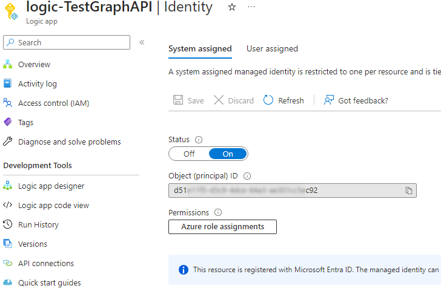
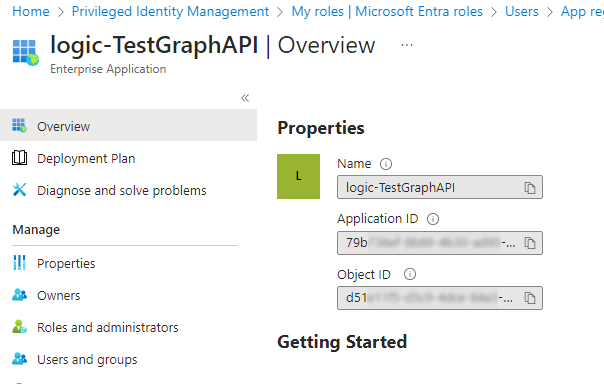
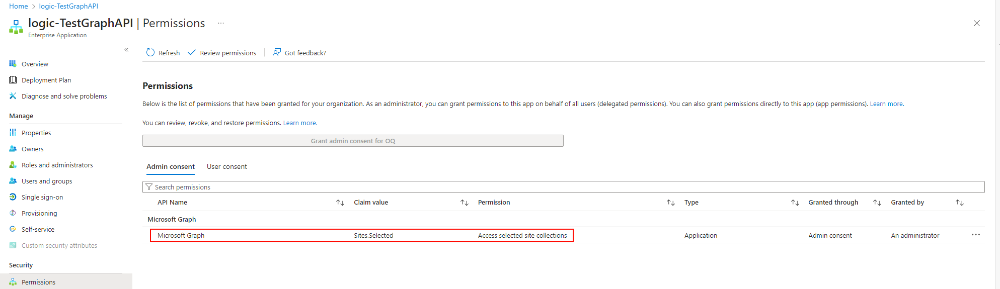
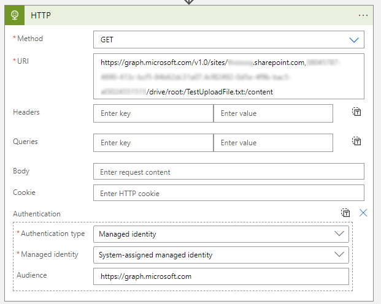
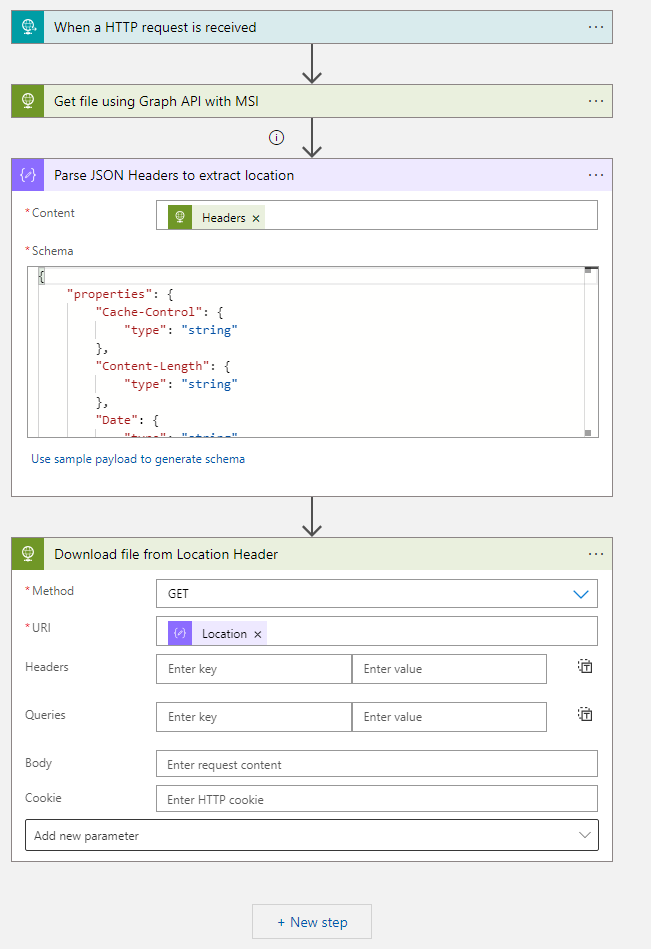

In this post we will discuss one very secure and efficient way to access SharePoint Online using Graph API, and that is by using Managed Identity.

## Introduction
Managed Identity in Azure, be it System Assigned or User Managed Identity, is an easy to manage and very secure authentication method. There are no secrets or certificates to manage, and it can be granted permissions the same way you
work with any other service principal or App Registration in Entra. So, it can access an Azure resource, be granted a Entra ID role, a Graph API permission, and - as we will see in this post - a SharePoint Online permission against a site.

## Tutorial
In this tutorial, we will use a Logic App with a system assigned managed identity (MSI) to download one file from SharePoint Online using Graph API.

### 1. Create a Logic App
For this example we use a consumption plan Logic App, but you can use any other type of Logic App or any Azure resource that supports MSI.

* Make sure to enable System assigned managed identity for the Logic App.

    

* Locate the Logic App in Entra under Enterprise Applications and note its Application ID.

    

### 2. Assign Graph API Permission to the Logic App
To make sure the MSI can only access the SharePoint sites we target, we will assign it the `Sites.Selected` permission.
The `Sites.Selected` permission does not actually provide any access to SharePoint, it just allows it to access the sites we will define in the next step.
Other permissions such as `Sites.Read.All` will give it access to all sites in the tenant, which is not what we want.

The permissions cannot be granted in the portal, so we will use PowerShell.
```PowerShell
# Graph API permissions to set
$oPermissions = @(
  "Sites.Selected"
)
$managedIdentityObjectId = '<Object Id from Logic App >'

Connect-MgGraph -Scopes AppRoleAssignment.ReadWrite.All,Application.Read.All

$sp = Get-MgServicePrincipal -ServicePrincipalId $managedIdentityObjectId

$GraphAppId = "00000003-0000-0000-c000-000000000000" # Don't change this.
$oGraphSpn = Get-AzADServicePrincipal -Filter "appId eq '$GraphAppId'"
$oAppRole = $oGraphSpn.AppRole | Where-Object {($_.Value -in $oPermissions) -and ($_.AllowedMemberType -contains "Application")}
foreach($AppRole in $oAppRole)
{
    $params = @{
        principalId = $sp.Id
        resourceId = $oGraphSpn.id
        appRoleId = $AppRole.Id
    }
    New-MgServicePrincipalAppRoleAssignment -ServicePrincipalId $sp.id -BodyParameter $params
}
```
Once the permissions are set, you can verify them in the portal.



### 3. Assign SharePoint Online permissions to the MSI
Again, we will use PowerShell this time to the SharePoint site. The possible Possible [permissions](https://learn.microsoft.com/en-us/graph/api/resources/permission?view=graph-rest-1.0#roles-property-values) are: read, write, owner. Note that we use the client (Application) ID (not Object Id)

These permissions cannot be viewed in SharePoint. So the last command lists all the granted permissions.

```PowerShell
Connect-MgGraph -Scopes Sites.FullControl.All,Sites.Manage.All,SharePointTenantSettings.Read.All,Sites.ReadWrite.All

$SharePointFQDN = 'contoso.sharepoint.com'
$SitePath = '/sites/TestLogicApp'
$ApplicationClientId = "<Application(Client)ID of the Logic App>"

$siteId = "{0}:{1}" -f $SharePointFQDN, $SitePath
$site = Get-MgSite -SiteId $siteId

# Add desired permission(s)
$params = @{
	roles = @(
        "write"
	)
	grantedToIdentities = @(
		@{
			application = @{
				id = $ApplicationClientId
				displayName = "New TestLogicApp Client Id"
			}
		}
	)
}
New-MgSitePermission -SiteId $site.Id -BodyParameter $params

# Confirm the added permission

$selectedProps = @(
    @{label="DisplayName";Expression = {$_.GrantedToIdentities.Application.DisplayName}}
    @{label="App Client Id";Expression = {$_.GrantedToIdentities.Application.Id}}
    'Roles'
    'Id'
)
Get-MgSitePermission -SiteId $site.Id  | ForEach-Object {Get-MgSitePermission -SiteId $site.Id  -PermissionId $_.Id} | Select-Object -Property $selectedProps
```

### 4. Configure the Logic App
Now that we have the permissions in place, time to configure the Logic App.

GraphAPI uses Rest Methods, we will use the HTTP action in the Logic App to call the Graph API. This action has built-in Managed Identity Authentication so we don't need to worry about that!

Here is what we are doing in details,
* We are downloading a file under:  `https://contoso.sharepoint.com/:t:/r/sites/TestLogicApp/Shared Documents/TestUploadFile.txt`
* To download the file, we use the  [driveitem resource](https://learn.microsoft.com/en-us/graph/api/driveitem-get)

    
* The drive item returns a redirect URL as HTTP 302, so we parse the output then follow the redirect to download the file.
    


Thats it! We have successfully used Managed Identity to access SharePoint Online using Graph API.
